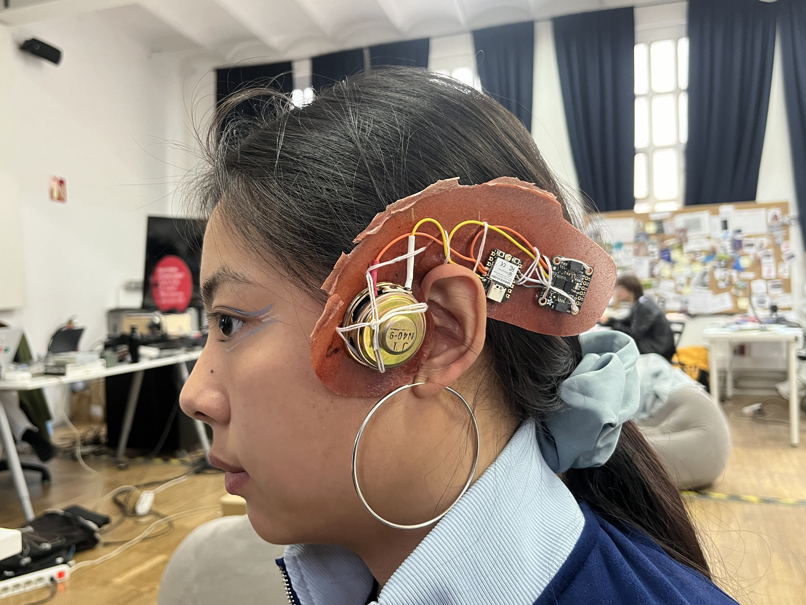

# Earring that reacts to head movements with real-time sound modification

This is our attempt to develop a DIY Bio-Electrical earring: the initial concept was to modify an audio file through head movements.
The signal that goes to the speaker was supposed to pass through a conductive bioplastic, in order to create an umpredictable noise to the track. 
Unfortunately, due to few time available, we had to simplify the project, and here we will illustrate our attempt.

This prototype allows you to change the pitch of an analog tone through the values of a gyroscope, and reproduce the sound in real-time through a spekaer.

ELECTRONICS:
- Seeed XIAO ESP32C3: https://wiki.seeedstudio.com/XIAO_ESP32C3_Getting_Started/
- Adafruit BNO08x: https://learn.adafruit.com/adafruit-9-dof-orientation-imu-fusion-breakout-bno085/arduino
- Speaker
- 5V Battery (We had to supply the power from the computer due to tehcnical problems :( )

WIRING: 
